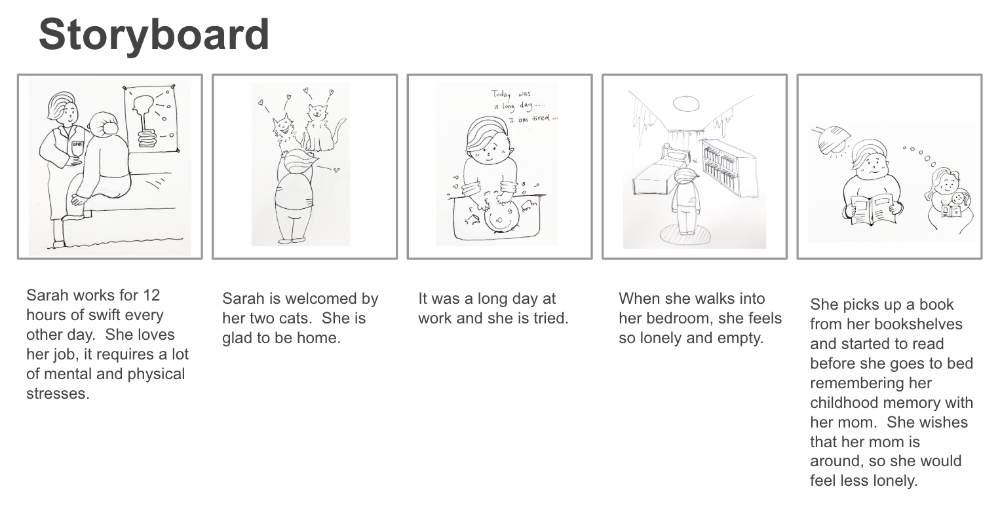
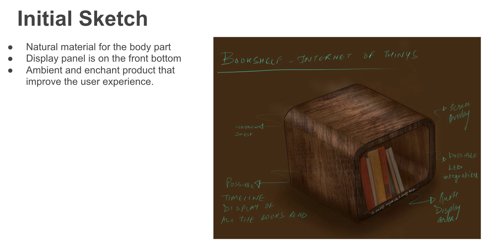
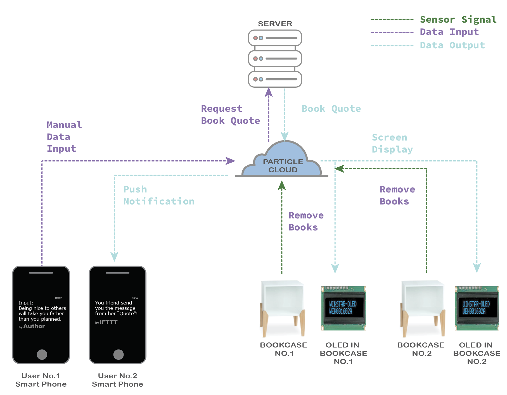
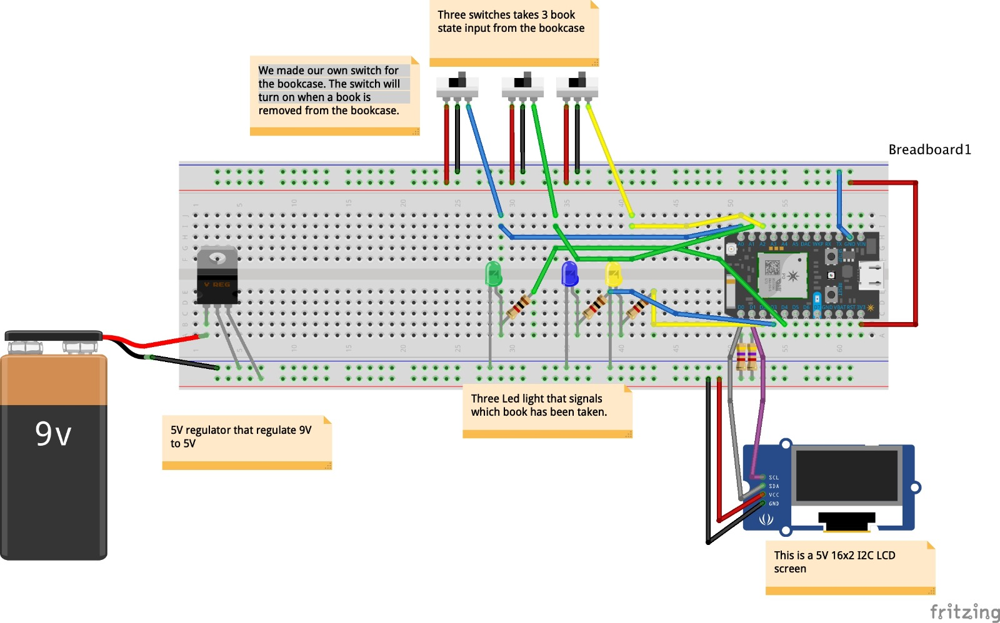
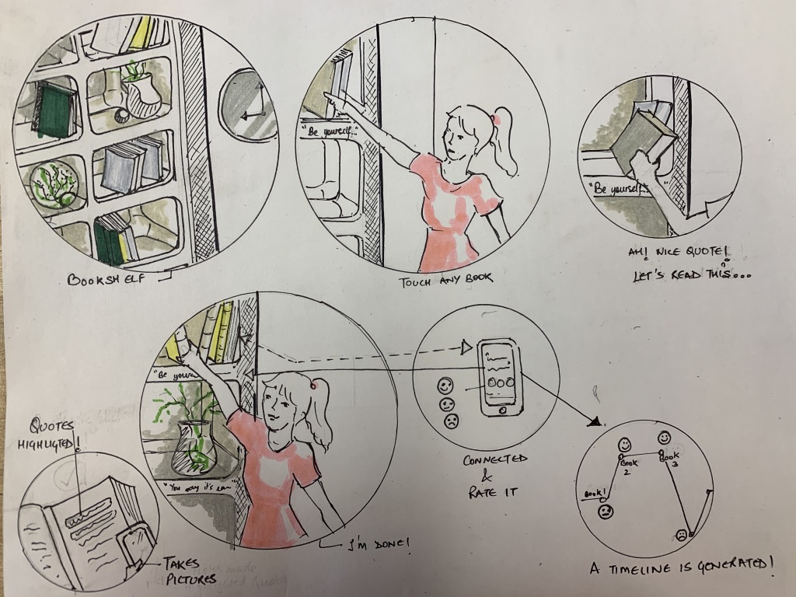

# Quote
## Colaborators
Arthur Cen, Tarika Jain, Hannah Moon
### Problem Statement / Co-Design
Sarah is 30 years old female working as a Physician Assistant at the UPMC Shadyside, Pittsburgh. She lives by herself with two cats. Although she has a successful career and loves her life, she always misses her mom who lives in a different city. She becomes even more sentimental when she goes back to her dark home. She loves to read because she has a good memory with her mom reading books before she went to bed every night when she was young. She wishes that there’s a product that helps her delightful childhood memory when she read every night.

### Stakeholder
After we interviewed with Sarah, we defined our potential stakeholders as below;

- Primary stakeholders are young professionals who live in big cities away from their families
- Secondary stakeholders are parents or love ones of primary stakeholders, booksellers and furniture makers 
- Key stakeholders are funders, book authors, publishers, medias

### Design Approach
Our team wants to make sure that Sarah feels homey when she relaxes at her house after spending long hours at the hospital. She is physically and mentally exhausted and wanted to feel eased while she is reading her favorite books at home. Also, she wants to feel connected with her mom away back home. 

### Design Decision and Solution
Our team decided to make an ambient bookcase that is connected to other devices, the same bookcase. Once one side of the user picks a book to read from the bookcase, the other side of the device displays the same title and quote. Two devices are connected in distance and help two or many parties to feel more connected to each other by reading the same books because they have something in common to share together. 

### Storyboard and Initial Sketch

### System Design Concept
Two and more users are interconnected with each other with the particle cloud system.  We want our bookcase helping us connect with the people in our lives and build intimate relationships by sharing common knowledge of reading books.  

### Component and Supplies
1. Particle Argon with headers
2. USB Micro B Cable
3. Wifi Antenna
4. 1 Mini Breadboards
5. 2x16 I2C 5V LCD Screen
6. Alligator clamps
7. 5V voltage regulator
8. 9V battery
9. Several Wires as needed and retray
10. Copper Fibers (for making manual switch)
11. Copper wires
12. LED lights
13. 2 x 4.75kΩ resistors and 3 x 1kΩ resistor

### Development Procedure
1. Co-design with a friend
2. Design the logic system of program
3. Check items that we need additionally especially the ones we do not have in our studio.
4. Write the coding according to the design we envisioned.
5. Connect with particle cloud.
6. Make a 1st proto bookcase with foam-core.
7. Install wires and sensors into the bookcase.
8. Connect a breadboard with wires.
9. Test out the entire system.  

### User Test
Sarah tested the sample and shared her experience with our team. She liked the sample overall and suggested one major improvement - changing sensors. Although she liked our first proto a lot, she did not like the way that she has to pay extra attention when she returns the books to the bookcase. She asked us if we can eliminate pedals and replace them with different sensors. In that sense, she does not have to worry about putting the books back to exact spots to land the books on the pedals.

We foresee her feedback and will iterate the sensors and the design accordingly.

We also found that the LED screen displayed symbols or alphabets instead of illuminating full sentences of quotations during the demonstration. After we disconnect the powers and plugin, it worked, but we will debug code error and fix the malfunctioning screen.

### Circuit diagram

### Video Demo
https://youtu.be/0PYfpzE6e-U

### Next Step
Our major improvement in this project would be data storage and share. We initially designed the product want our friend to store her memorable quote in the cloud system and erase the data if she wants to update it with new quotes. However, we found the opportunity that the user would feel more connected and attached to the bookcase if they can keep all their memory in the server.  The improved design scenario is attached below.  

Also, we found that similar technology can be adopted by the public library to promote citizens to read more books. One of the visitors to our booth shared his idea of how he would better interact with library bookshelves if the bookshelves speak about books at the library.  

Also improving the sensor parts is a key factor we are considering improving for future development. As our friend Sarah wanted to take and put back books without landing the books on designated spots.  We will explore sensor options to iterate. 

We also want to improve LED screens to be more of an enchant and ambient like "mui: 'Calm' Interface Device Made of Natural Wood".  Please see the attached reference picture below. 

A commercializing bookcase by partnering with book publishers can be an option. Our bookcase can store famous Harry Porter Series or The Hardy Boys Series as gift options for children.  

### Team Project Reflection

As part of this group project, we were assigned the task of creating a group presentation in which we would design one of our friends about a chosen IoT topic. My group was able to build and present a successful presentation by building a smart bookcase that connected to a cloud system, creating a prototype, and iterating the sample based on the user test. 

Through this project, our team learned about several factors of collaboration that need to be in place in order for a group to smoothly and successfully reach our final goal. One of these aspects is good lines of communication. At the beginning of the project, we did not divide the job clearly and communicate closely or share the necessary information among team members. 

After we experienced a rough start, our groups divided the workload among members clearly to move closer to the final goal and were able to accomplish our final goal on time.  We have learned how to fulfill each assigned role according to the group's established timeline. 

Next time, we all hope to be flexible with each other's ideas to determine what would work for the project or how to make something work even better as a team. 

It was a great learning experience.   